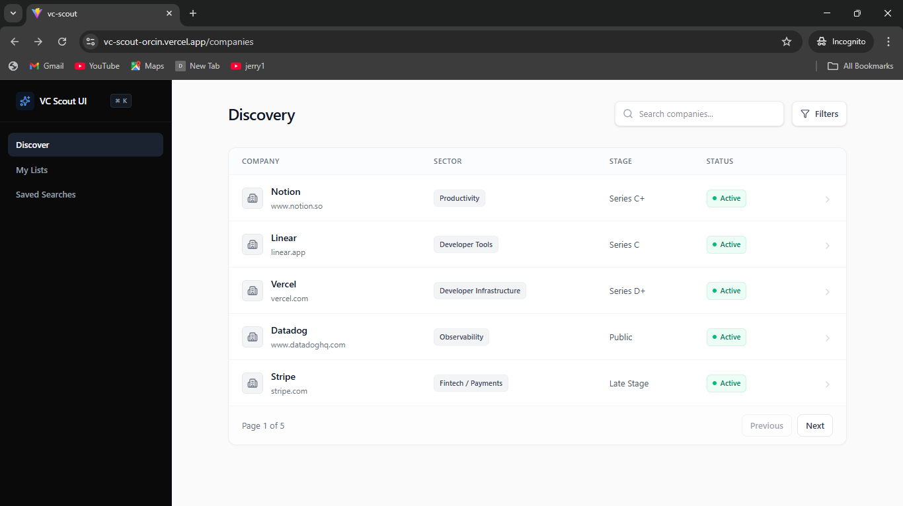
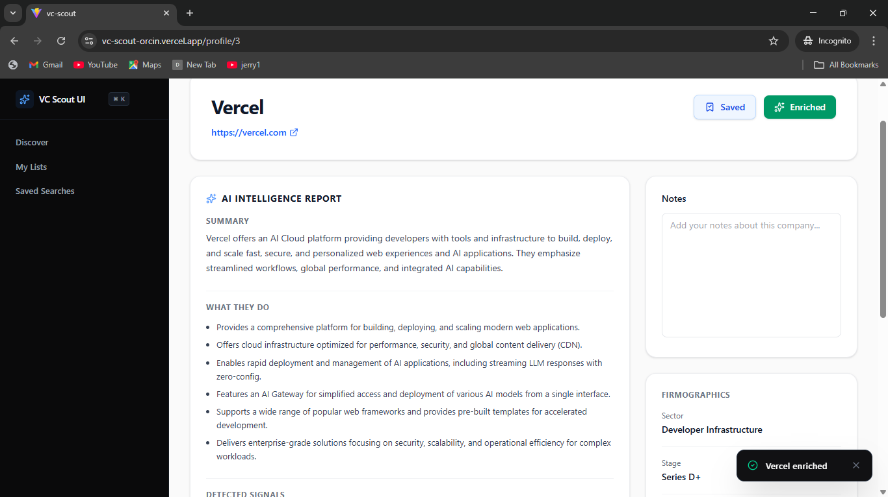
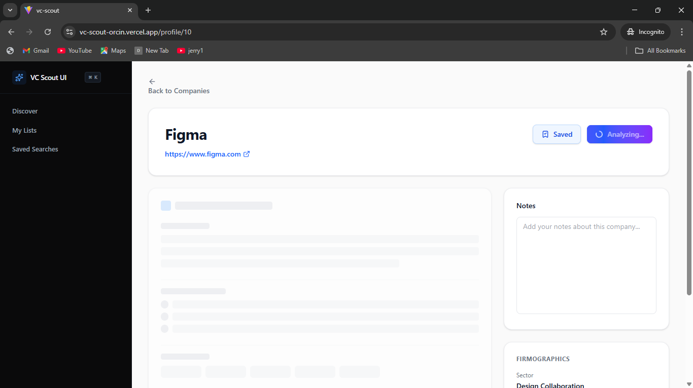
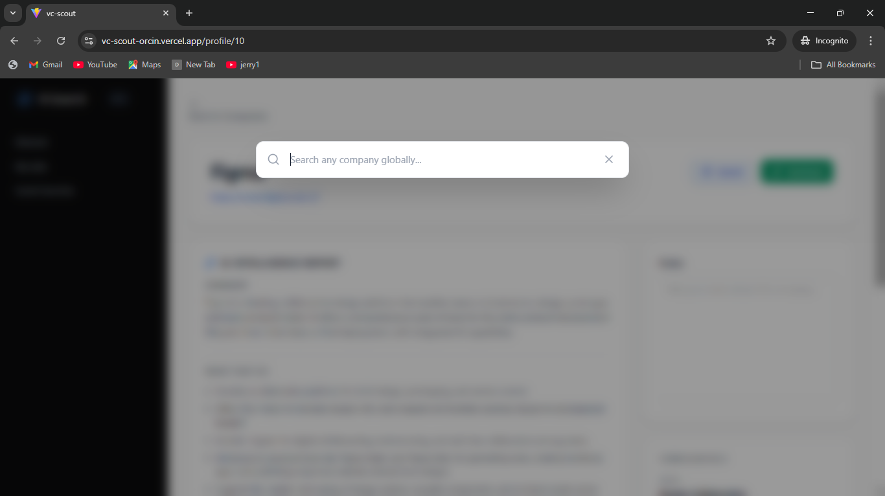

<div align="center">
  <h1>🧭 VC Scout Intelligence</h1>
  <p><strong>A precision AI scouting interface built for Venture Capital funds.</strong></p>
  
  <p>
    <a href="https://vc-scout-q0jn4bpqv-simpush-43s-projects.vercel.app/"><strong>🟢 VIEW LIVE DEPLOYMENT</strong></a> · 
    <a href="#-local-setup"><strong>Read the Docs</strong></a>
  </p>

  <p align="center">
    
    
    
    
  </p>
</div>

---

## 📖 Overview

VC Scout is a high-density, Harmonic-style discovery platform designed to transform thesis-driven sourcing. It allows investors to seamlessly search companies, filter by stage/sector, and instantly enrich profiles with live, AI-extracted signals scraped directly from public web data.

> **Note on the "Core Test":** This application strictly adheres to the security requirement of the assignment. The `GEMINI_API_KEY` is never exposed to the client. All scraping and LLM extraction happens securely on the backend via a Vercel Serverless Function (`/api/enrich`).

---

## ✨ Core Workflows & Features

### 🔍 Discovery & Profiling
* **High-Density Data Table:** Sortable headers, stage/sector filtering, and active pagination tailored for fast scanning.
* **Live AI Enrichment:** Click "Live Enrich" to trigger a secure serverless function that fetches live HTML, sanitizes the DOM, and uses **Google Gemini 2.5 Flash** to extract:
  * 1-2 sentence business summaries.
  * Bulleted "What they do" breakdowns.
  * Derived VC signals mapped to a visual timeline.
  * Extracted SaaS keywords.
* **Thesis Management:** Build target lists, toggle saved states, and write persistent Analyst Notes.
* **Data Export:** Instantly download curated lists as `.csv` or `.json` payloads.

### ⚡ Premium UX (Power-User Touches)
* **`⌘+K` Global Search:** A custom, blurred modal accessible anywhere in the app for instant navigation.
* **Aggressive Client Caching:** AI reports, notes, and lists are cached locally using custom `useLocalStorage` hooks for zero-latency reloads.
* **Custom Toast Context:** Animated, dark-mode success/error states built entirely from scratch without external libraries.
* **Graceful Fallbacks:** Custom `404` routing and a global React `<ErrorBoundary />` to prevent "white screen" crashes.

---

## 🏗️ Architecture

```text
├── api/
│   └── enrich.js       # Vercel Serverless Function (Cheerio + Gemini AI)
├── src/
│   ├── assets/
│   ├── components/     # Reusable UI (GlobalSearch, ErrorBoundary, Sidebar)
│   ├── contexts/       # Global State Providers
│   ├── hooks/          # Custom Hooks (useLocalStorage)
│   ├── pages/          # React Router Views (Discovery, Profile, Lists)
│   ├── App.jsx
│   ├── main.jsx
│   └── mockData.js     # Seeded JSON dataset
├── vercel.json         # Route rewrites for React Router SPA
└── vite.config.js      # Frontend build configuration
💻 Local Setup
Clone the repository:

Bash
git clone [https://github.com/Simpush-43/VC-Intelligence-Interface.git](https://github.com/Simpush-43/VC-Intelligence-Interface.git)
cd VC-Intelligence-Interface
Install dependencies:

Bash
npm install
Configure Environment Variables:
Create a .env.local file in the root directory and add your Google AI Studio key:

Code snippet
GEMINI_API_KEY=your_google_ai_studio_key_here
Run the Development Server:
Because this project uses Vercel Serverless API routes, use the Vercel CLI to run the frontend and backend simultaneously:

Bash
npm i -g vercel
vercel dev
The app will be live at http://localhost:3000.